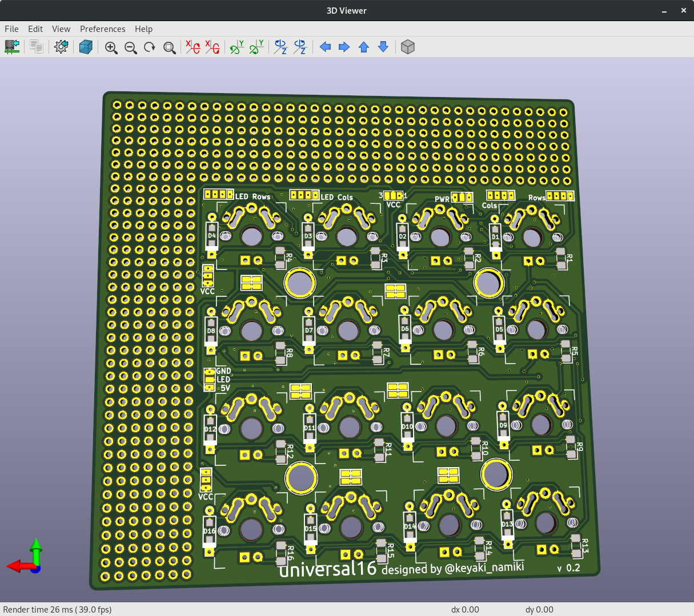

## universal16

4x4 symple Key-matrix (and some functions) with universal board

### feature(s)

- No wire is there between matrix(es) and controller footprint (for trying new controller such as Arduino, Mbed, PIC,and so on...)
- Matrix circuit is been dragged out to pads for hand-wiring
- Jumper pads for making 'hand-wiring' easier
- The universal board part for making your function (rotary encoder, potentiometer, joystick module, etc...)
- You can use universal board part in both left-side and right-side

