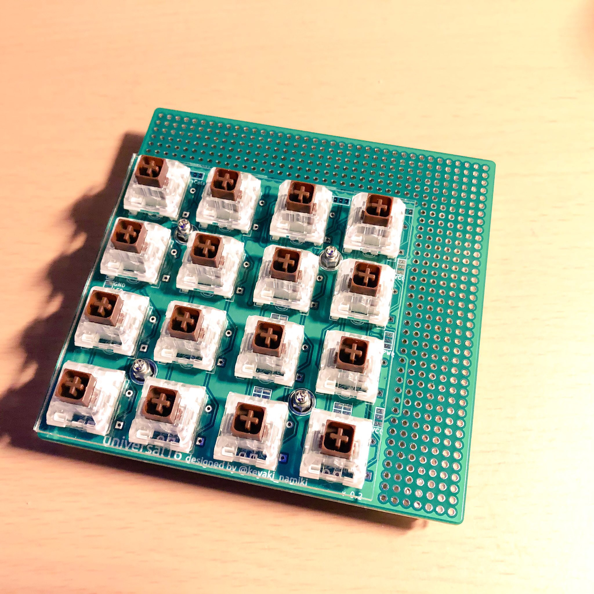
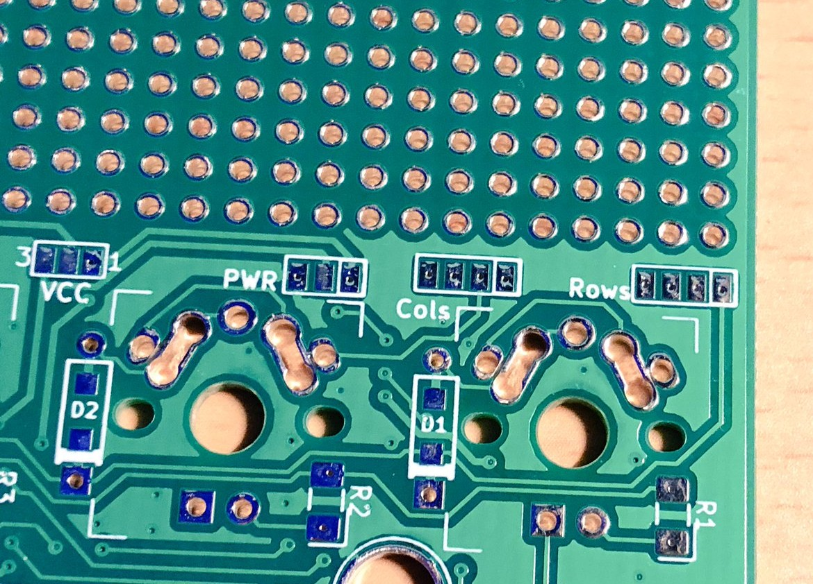
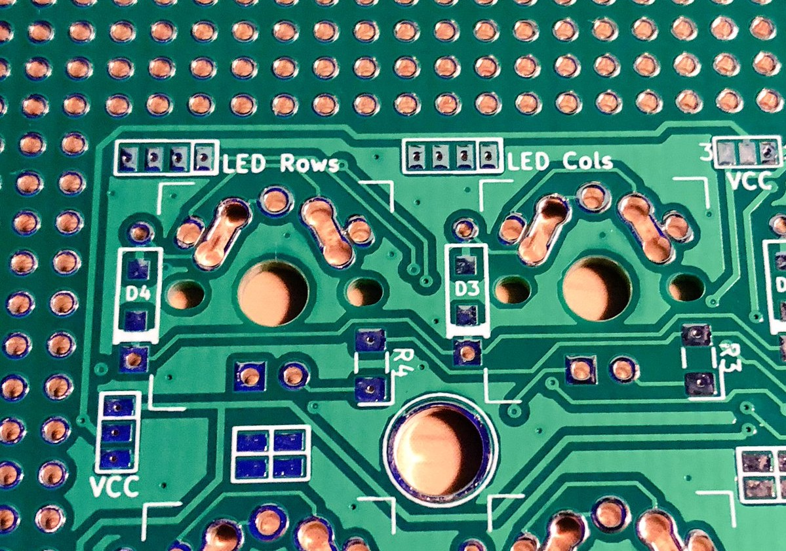
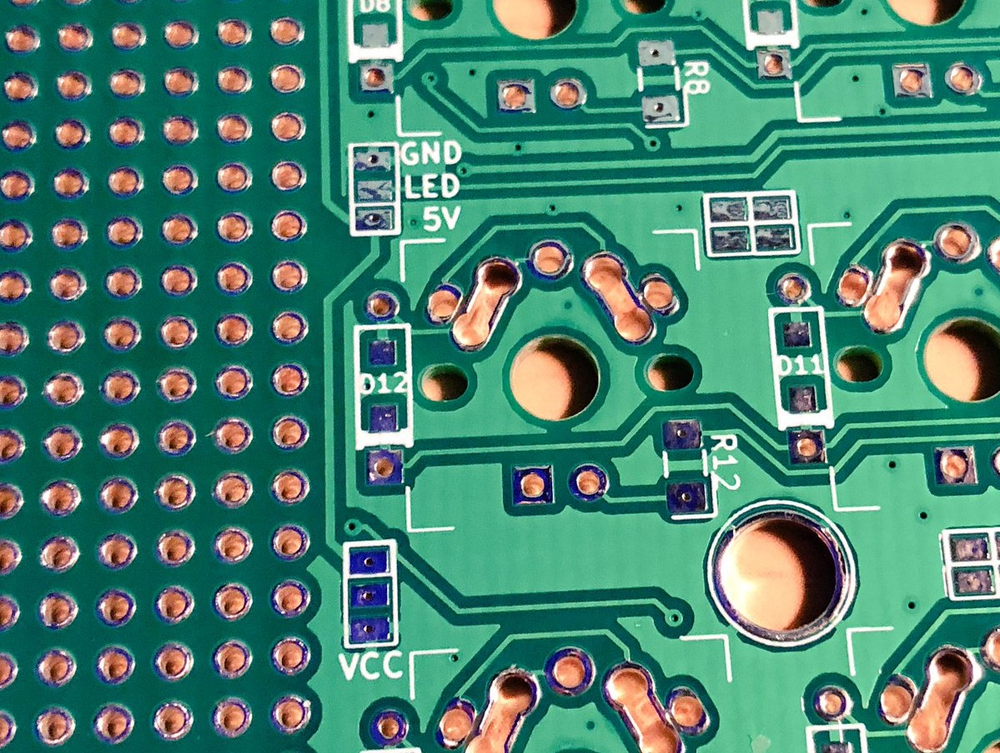
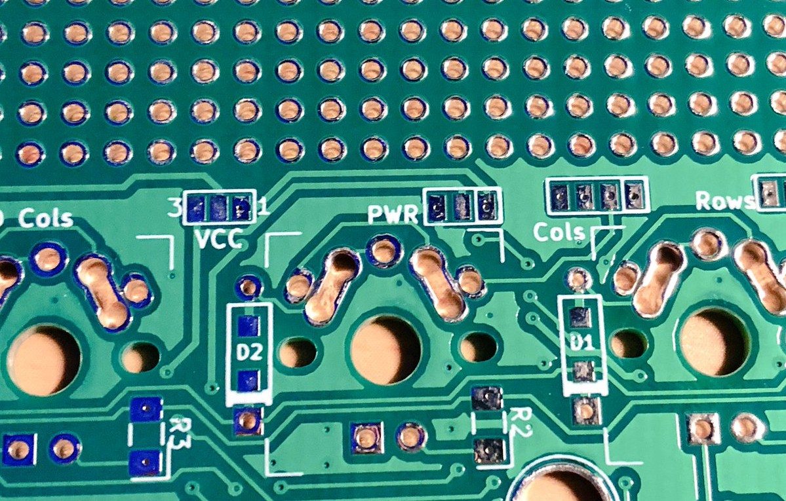
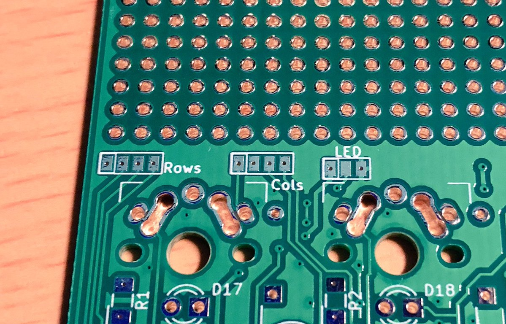
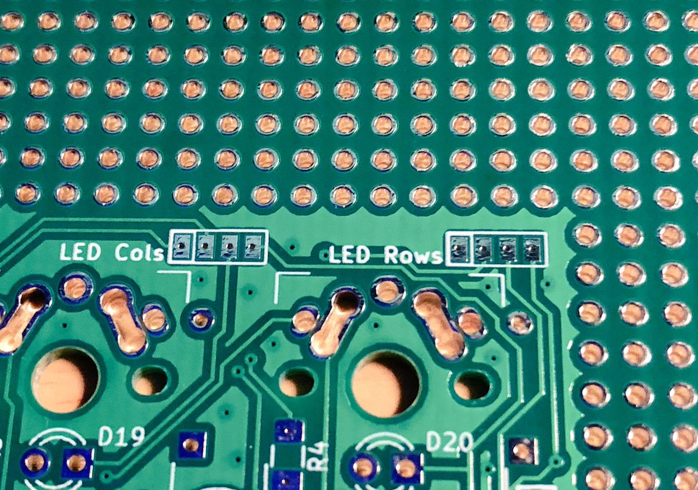
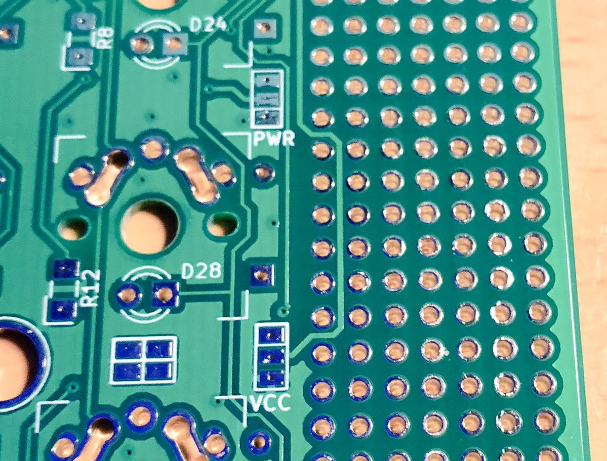

## universal16 Stem

universal16 Stem は4x4のキーマトリクスとユニバーサル基板を組み合わせた基板'universal16 alpha'のプレートマウント対応版です。 
この基板は以下の部品と合わせて使うことを想定しています。

|部品名|型番等|数量|備考|
|---|---|---|---|
|トッププレート|[acrylic/universal16](../case/acrylic/universal16.dxf)|1枚||
|ボトムプレート|[acrylic/universal16_bottom](../case/acrylic/universal16.dxf)|1枚||
|スペーサー|M2(7~8mm/4mm)|4個|ロープロファイルスイッチを使う場合、 4mmのスペーサーを使うことで高さを抑えることができます。|
|ネジ|M2(5~6mm/3mm)|8個||
|ダイオード|1N4148等|16個|リードタイプ推奨、表面実装も可|
|キースイッチ|Cherry MX互換品/Kailh LP|16個||
|キーキャップ|上記対応品|16個|選択したキースイッチで使用可能なキーキャップをご準備ください。|

この他に、コントローラや配線材などが必要になります。
また、バックライトLEDを使う場合は更に3mm砲弾型LEDと1206/3216サイズのチップ抵抗をそれぞれ16個ずつご準備ください。

## 配線について
universal16 Stemでは、基板の回路がパッドとして引き出してあります。どのパッドがどの配線につながっているかよく確認しながら配線してください。 なお、以降特に言及がない限りひとつ白枠で囲まれたものPad1として扱います。

-----
- Rows/ColsはPad1からRow/Col0-3、PWRはPad1から5V,3.3V(または任意の電圧),GND。
- ダイオード(D1-D16)を線の太い方/穴の四角い方をCathodeとして実装するとアクティブロー回路として使うことができます。

-----
- LEDRows/LEDColsはPad1からLEDRow/LEDCol0-3。 
  - D17-D32に'四角いスルーホール側をCathodeとしてLEDを実装した'場合、LEDRowがAnode(+)側と、LEDColがCathode(-)側とつながるように配線してあります。R1−R16に適切な値のチップ抵抗を実装してください。 
- VCCには2種類(後述)あるので注意してください。数字の書いていないVCCはPad1から5V,VCC,GND。

- 特にシルク印刷のない田の字型のパッドは隣り合った左右同士で以下のようにつながっています。コントローラ-ユニバーサル基板部分間を配線する際の中継地点としてご活用ください。

|1|1|
|--|--|
|2|2|

-----
- GND,LED,5Vのシルク印刷があるパッドにポリウレタン銅線などで配線することでunderglow用のLEDテープを実装できます。

-----
- 2種類目のVCCには1と3のシルク印刷があります。1の印刷のある方から5V,VCC,3.3V(または任意の電圧)。ここを'はんだ'などで繋ぐことでさきほどのVCCに5Vまたは3.3V(または任意の電圧)を供給することができます。 
  - あるいはここを'はんだ'などで繋がずに'VCC'をVCCではない独立した信号線として用いることもできます。

-----
- おもて面にもRows/Colsなどのパッドがあるので、ユニバーサル基板部分を左側に置いて使うこともできます。 
- underglow用のLED信号線はおもて面にのみ引き出してあります。Pad1から5V,LED,GND。

おもて面にはダイオード(D1-D16)についてシルク印刷がありませんが、キースイッチ横の2つのスルーホールは裏と表でつながっていますのでうら面と同じように実装することができます(リードタイプのみ)。

-----
